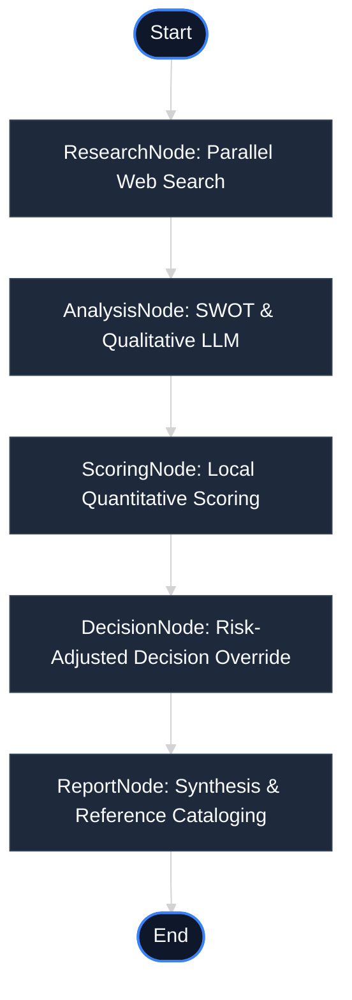

# AI Investment Research Agent

A full-stack, production-grade AI Agent designed to perform institutional-grade quantitative and qualitative investment research on public companies. Powered by **LangGraph.js**, **Google Gemini** (via native Google AI SDK or **OpenRouter**), and **Tavily Search API**, this application structures complex web research into a clean, modern financial dashboard.

---

## 📈 System Architecture

The core of the application is built as a stateful multi-node graph workflow using **LangGraph.js**, which ensures deterministic scoring, logical isolation of reasoning blocks, and robust safety guardrails.

### Workflow Graph


### The 5-Node Processing Pipeline
1. **Research Node**: Queries **Tavily Search** across 5 distinct facets of the company (Overview, Competitors, Recent News, Growth Opportunities, and Investment Risks) in parallel using `Promise.all` to minimize API latency.
2. **Analysis Node**: Invokes Gemini via structured schemas to extract grounded SWOT categories, market standing, and evaluation confidence based strictly on the retrieved source material.
3. **Scoring Node**: Evaluates a local rules-based quantitative scorecard (max 100 points) checking Growth Potential, Innovation Index, Market Position, and Risk Metrics.
4. **Decision Node**: Maps a base recommendation (`INVEST`, `WATCH`, or `PASS`). If safety guardrails fail (e.g., Risk Score falls below `8/25`), it triggers a risk-adjusted override, downgrading `INVEST` to `WATCH` to protect capital.
5. **Report Node**: Synthesizes the overall executive summary and compiles a deduplicated index of web sources and URLs.

---

## 🚀 Key Features

* **Dual LLM Provider Support**: Dynamically detects the format of your API key. Supports native **Google Gemini API keys** (`AIzaSy...`) and **OpenRouter keys** (`sk-or-...`) out of the box.
* **Fail-Fast & Resilient Fallbacks**: If the Gemini/OpenRouter API key is rate-limited (429) or Google's servers experience high load (503), the backend fails fast within 5s and returns a structured fallback report so the UI never hangs.
* **Axios Request Safeguards**: Configured with a 90-second client-side timeout to absorb high LLM generation latency on free-tier keys.
* **Premium Dashboard-Style UI**: Modern dark-theme interface with smooth transitions, progress loaders, a recommendation hero card, interactive score gauges, SWOT grid panels, competitor tables, and direct source references.

---

## 🛠️ Environment Configuration

Create a `.env` file in the `/server` directory:

```env
# Backend server port
PORT=5000

# Tavily Search API key
TAVILY_API_KEY=your-tavily-api-key

# LLM Provider Key (Supports native Gemini starting with AIzaSy or OpenRouter starting with sk-or-)
Google_GeminiAPI_KEY=your-api-key

# Optional: Specify the model name (Defaults to gemini-2.5-flash for Google API, google/gemini-2.5-flash for OpenRouter)
GEMINI_MODEL=gemini-2.5-flash
```

---

## 💻 Local Quickstart

### 1. Install Dependencies
```bash
# In the project root, install backend and frontend packages
cd server && npm install
cd ../client && npm install
```

### 2. Start Backend Server
```bash
cd server
npm run dev
# Server will run at http://localhost:5000
```

### 3. Start Frontend Client
```bash
cd client
npm run dev
# Client will run at http://localhost:3000 (or http://localhost:3001)
```

---

## 🌐 Production Deployment Guide

### Backend (Deployed on Render / Railway / Heroku)
1. **Create Web Service**: Connect your GitHub repository and point the build directory to `server/`.
2. **Build & Start Commands**:
   - Build Command: `npm install`
   - Start Command: `npm start`
3. **Environment Variables**: Add your `Google_GeminiAPI_KEY`, `TAVILY_API_KEY`, and `PORT` to the host's env dashboard.

### Frontend (Deployed on Vercel)
1. **Import Project**: Select the project repository in Vercel.
2. **Build Settings**:
   - Framework Preset: `Vite`
   - Root Directory: `client`
   - Build Command: `npm run build`
   - Output Directory: `dist`
3. **Environment Variables**: Add `VITE_API_URL` pointing to your deployed backend service URL (e.g., `https://your-backend-service.onrender.com`).

---

## 🔮 Future Architectural Recommendations

1. **Research Caching (Redis)**: Implement a caching layer for Tavily Search results matching specific company names (TTL of 24–48 hours) to minimize search budget usage and drop API latency to under 3s.
2. **Web Crawlers**: Incorporate a custom scraper (using Puppeteer or JSDOM) to fetch complete body text from key financial reference URLs instead of relying only on Tavily text snippets, enhancing LLM reasoning quality.
3. **User Management**: Add a Firebase/Supabase auth layer to enforce search limits per user, keeping API consumption within free or custom pay-as-you-go boundaries.
4. **Vector Embeddings (RAG)**: Store crawled financial reports in a vector database (e.g., Pinecone or pgvector) to allow semantic searching across long company filings (10-K, 10-Q) alongside Tavily web results.
