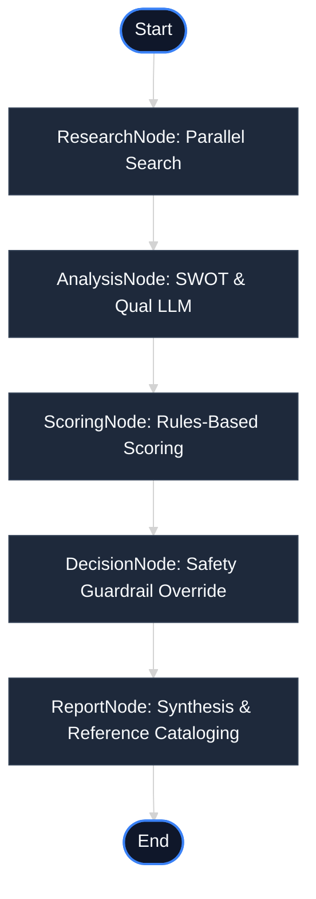

# AI Investment Research Agent

A production-grade, full-stack AI Investment Research Agent that automates institutional-grade quantitative and qualitative research on public companies. The application performs web research, conducts SWOT analyses, calculates financial scorecard metrics, enforces investment safety guardrails, and renders findings in a sleek dashboard.

* **GitHub Repository**: [https://github.com/Tejpraval/InsideIIM](https://github.com/Tejpraval/InsideIIM)
* **Live Deployment (Vercel)**: [https://inside-iim.vercel.app/](https://inside-iim.vercel.app/)
* **Production API Health (Render)**: [https://insideiim.onrender.com/health](https://insideiim.onrender.com/health)

---

## 1. Overview

### What the Application Does
The AI Investment Research Agent accepts a company name and generates a comprehensive investment analysis. In under 10 seconds, it fetches recent news, analyzes competitor landscapes, drafts a qualitative SWOT analysis, scores the business across four domains, runs a safety risk guardrail, and outputs a final recommendation (`INVEST`, `WATCH`, or `PASS`) backed by clickable source references.

### Problem Being Solved
* **Data Overload**: Investors must manual search multiple news channels, press feeds, and financial summaries. The agent gathers and deduplicates this in parallel.
* **Ungrounded Hallucinations**: Standard LLM search prompts often generate inaccurate facts. This agent grounds all SWOT bullet points and summaries strictly in Tavily-searched web references.
* **Math Drift**: LLMs struggle with consistent mathematical evaluations. The agent enforces a deterministic, rules-based scoring engine for financial scorecards.
* **Safety Violations**: LLMs tend to be overly optimistic. The agent uses local risk guardrails to override the LLM's recommendation if a company's qualitative risk profile is high.

### Technologies Used
* **Backend**: Node.js, Express.js, ES Modules
* **AI Orchestration**: LangGraph.js (Stateful multi-node workflows)
* **LLM Engine**: Google Gemini (via native Google AI SDK or OpenRouter integration)
* **Search Integration**: Tavily Search API (parallel query orchestration)
* **Frontend**: React, Vite, Tailwind CSS, Axios, Lucide Icons

---

## 2. How to Run It

### Prerequisites
* **Node.js** (v18.0.0 or higher)
* **npm** (v9.0.0 or higher)

### Setup Steps

1. **Copy the Environment Template**
   Copy the `.env_example` file from the root directory into the `server/` directory and rename it to `.env`:
   ```bash
   # Unix-based (macOS/Linux)
   cp .env_example server/.env

   # Windows PowerShell
   Copy-Item -Path .env_example -Destination server\.env
   ```

2. **Add Your Own API Keys**
   Open the newly created `server/.env` file and replace the placeholder values with your valid credentials:
   * **`TAVILY_API_KEY`**: Your Tavily Search API key.
   * **`OPENROUTER_API_KEY`** (or `Google_GeminiAPI_KEY`): Your OpenRouter or native Google Gemini API key.

3. **Install Dependencies**
   Run the installation command in both the `server` and `client` directories:
   ```bash
   # Install Backend dependencies
   cd server && npm install

   # Install Frontend dependencies
   cd ../client && npm install
   ```

4. **Start the Application**
   Run the development commands in separate terminals:
   
   **For the Backend Server:**
   ```bash
   cd server
   npm run dev
   # Runs on http://localhost:5000
   ```

   **For the Frontend Client:**
   ```bash
   cd client
   npm run dev
   # Runs on http://localhost:3000
   ```
### Running Locally
To run a query locally, make sure both terminals are active. Navigate to `http://localhost:3000` in your web browser, enter a company name (e.g., "Apple" or "Nvidia"), and click **Analyze**.

---

## 3. How It Works

### Architecture Diagram (Mermaid)



### Workflow

* **`ResearchNode`**: Takes the input company name and spins up 5 parallel queries using Tavily Search (Company Overview, Competitors, Press News, Growth Opportunities, Operational Risks). Using parallel `Promise.all` queries avoids sequential lag and finishes in ~2s.
* **`AnalysisNode`**: Packages search findings into a detailed prompt and invokes Gemini using structured schemas. The LLM extracts qualitative strengths, weaknesses, opportunities, threats, market standing, and confidence scores based strictly on the research text.
* **`ScoringNode`**: Evaluates a local rules-based scorecard out of 100 points based on the SWOT outputs:
  * **Growth Score (25 pts)**: Base growth potential modulated by the count of opportunities (+1.3 pts each).
  * **Risk Score (25 pts)**: Deducts points based on weaknesses (-1.5 pts each), threats (-1.5 pts each), and low research confidence.
  * **Market standing (25 pts)**: Evaluates classification (e.g., Dominant Player gets 20 pts) + strengths (+1 pt each).
  * **Innovation index (25 pts)**: Scans SWOT arrays for keywords (AI, cloud, battery, robotics, chip, software) and adds points (+1.5 pts per occurrence).
* **`DecisionNode`**: Maps the overall scorecard to a base recommendation: `INVEST` (score >= 70), `WATCH` (50–69), or `PASS` (< 50). If the Risk Score falls below a safe threshold of `8/25`, a **Risk Override** is triggered, automatically downgrading an `INVEST` rating to `WATCH` to enforce capital safety.
* **`ReportNode`**: Compiles a deduplicated index of all web references, logs latency benchmarks, and uses Gemini to write a professional 3-sentence executive summary.

---

## 4. Key Decisions & Trade-offs

* **Why LangGraph instead of a single prompt?**
  A single prompt makes it difficult to control LLM hallucinations, enforce logical separation, or insert local mathematical validation. LangGraph allows us to build stateful multi-node workflows, enabling strict step-by-step auditing, separate node fallbacks, and deterministic code insertion between LLM states.
* **Why Tavily instead of scraping?**
  Raw web scraping is slow, prone to Cloudflare blocks, and yields unstructured HTML garbage. Tavily aggregates, filters, and returns clean text snippets and source URLs directly optimized for LLM consumption, keeping research latency under 3 seconds.
* **Why Gemini 2.5 Flash / 1.5 Flash?**
  Flash offers exceptionally fast response times, a large context window, and native Zod-structured schema parsing support.
* **Why deterministic scoring?**
  LLMs are notoriously bad at arithmetic and can give different scores for the same text. Enforcing a rules-based parser on the backend ensures that if two companies have the same SWOT data, they receive the exact same score.
* **Why risk guardrails?**
  Generative models lean toward optimism. A company like Tesla might score high on growth and innovation, but carry severe operational liabilities. A local risk-mitigation rule (Risk Score check) forces a downgrade to protect capital.
* **Trade-offs accepted**:
  * **Context Snippets**: We analyze Tavily search snippets rather than reading full-text 10-K PDFs to keep latency low.
  * **Free-Tier Limits**: To prevent app crashes, we configured `maxRetries: 1` and implemented fallback templates to immediately render the dashboard if Gemini rate-limits (429) or is overloaded (503).
* **Features intentionally left out**:
  * Real-time stock prices (outside the scope of a static research agent).
  * User portfolios and historical charting (avoided bloat to focus on LLM workflow engineering).

---

## 5. Example Runs

### Tesla
* **Score**: 82/100
* **Grade**: A
* **Recommendation**: `WATCH` (Base recommendation `INVEST` was downgraded to `WATCH` due to a high risk score of `7/25` from vehicle safety lawsuits and Autopilot litigation).
* **Screenshot**:
  

### Apple
* **Score**: 85/100
* **Grade**: B
* **Recommendation**: `WATCH`
* **Screenshot**:
  

### Nvidia
* **Score**: 85/100
* **Grade**: A
* **Recommendation**: `INVEST` (Safety check passed; high growth potential and clean risk profile).
* **Screenshot**:
  

---

## 6. What I Would Improve With More Time

* **Redis Caching**: Save research results by company name for 24 hours to eliminate duplicate search queries and drop latency to 1 second.
* **Retrieval Augmented Generation (RAG)**: Store downloaded annual reports (10-K filings) in a vector database like Pinecone and query it alongside web searches.
* **Financial Statement Analysis**: Parse numerical Excel sheets (Balance Sheet, Cash Flow) directly using python/Node libraries to score actual debt-to-equity and PE ratios.
* **User Accounts**: Introduce Firebase/Supabase auth to manage user search history and save research reports.
* **Historical Performance Benchmarking**: Allow users to run comparative audits between competitor dashboards side-by-side.

---

## 7. LLM-Assisted Development Process

### LLM Tooling
* **Claude / Gemini / GPT-4o** were used to pair-program and accelerate development.

### Prompting Strategy
* **Structured Templates**: Prompts were designed to instruct the model to return strict, clean JSON blocks with unescaped quote overrides to prevent parsing exceptions.
* **Logical Refinements**: The quantitative scoring rules and risk override thresholds were designed iteratively with prompt feedback.
* **Debugging**: When hitting Google rate limits (429) or service overloads (503), the LLM helped configure `maxRetries` limits and draft the fail-safe fallback objects.

---

## 8. LLM Chat Logs (Bonus)
All major prompt chains, debugging sessions, and architectural iterations are documented and saved inside the [llm-logs/](file:///c:/downloads/InsideIIM/llm-logs) folder containing [architecture.md](file:///c:/downloads/InsideIIM/llm-logs/architecture.md), [implementation.md](file:///c:/downloads/InsideIIM/llm-logs/implementation.md), and [testing-and-deployment.md](file:///c:/downloads/InsideIIM/llm-logs/testing-and-deployment.md).

---

## 9. Folder Structure

```text
InsideIIM/
├── client/                     # React + Vite Frontend
│   ├── src/
│   │   ├── components/         # Dashboard UI Modules
│   │   │   ├── CompetitorCard.jsx
│   │   │   ├── DecisionCard.jsx
│   │   │   ├── LoadingState.jsx
│   │   │   ├── NewsCard.jsx
│   │   │   ├── References.jsx
│   │   │   ├── ResearchSummary.jsx
│   │   │   ├── ScoreCard.jsx
│   │   │   ├── SearchBar.jsx
│   │   │   └── SWOTCard.jsx
│   │   ├── services/
│   │   │   └── api.js          # Client Axios configuration
│   │   ├── App.jsx             # React Shell and State Coordinator
│   │   ├── index.css           # Custom Tailwind Design tokens
│   │   └── main.jsx
│   ├── index.html
│   ├── package.json
│   ├── tailwind.config.js
│   └── vite.config.js
├── server/                     # Node.js + Express Backend
│   ├── src/
│   │   ├── config/
│   │   │   └── gemini.js       # Dynamic Gemini/OpenRouter Wrapper
│   │   ├── controllers/
│   │   │   └── analyzeController.js
│   │   ├── langgraph/          # Stateful workflow orchestration
│   │   │   ├── nodes/          # Pipeline processing nodes
│   │   │   │   ├── AnalysisNode.js
│   │   │   │   ├── DecisionNode.js
│   │   │   │   ├── ReportNode.js
│   │   │   │   ├── ResearchNode.js
│   │   │   │   └── ScoringNode.js
│   │   │   ├── graph.js        # Graph Edge Assembly
│   │   │   └── state.js        # State Blackboard schema
│   │   ├── routes/
│   │   │   └── analyze.js
│   │   ├── services/
│   │   │   └── tavilyService.js # Raw HTTP Search Integration
│   │   └── index.js            # Express Entry and Health Check diagnostics
│   ├── .env                    # Local Env Configuration
│   └── package.json
├── llm-logs/                   # Prompt Engineering history logs
│   ├── architecture.md
│   ├── implementation.md
│   └── testing-and-deployment.md
├── screenshots/                # Application dashboard screenshots
│   └── .gitkeep
├── README.md                   # Project Documentation
├── deployment_links.md         # Deployed web and repo urls index
├── testing_report.md           # API validation & test reports
└── walkthrough.md              # Technical project walkthrough
```

---

## 10. Deployment

### Frontend: Vercel
* Root Directory: `client`
* Framework Preset: `Vite`
* Output Directory: `dist`
* Environment Variables: `VITE_API_URL` pointing to Render backend.

### Backend: Render
* Root Directory: `server`
* Build Command: `npm install`
* Start Command: `npm start`
* Environment Variables: `TAVILY_API_KEY`, `OPENROUTER_API_KEY`, `GEMINI_MODEL`, `PORT`.

---

## 11. Interview Notes

* **Why LangGraph?**
  It turns chaotic prompting into a structured engineering pipeline. It allows isolated node auditing, custom state data passing, and logical routing (e.g. running loops or triggers).
* **Why Tavily?**
  It is search custom-tailored for AI. It filters irrelevant ads, formats content into LLM-friendly snippets, and compiles source index directories.
* **Why deterministic scoring?**
  To maintain mathematical auditability. Investors need consistent score assignments rather than model-generated numbers that drift depending on temperature.
* **Why WATCH recommendation exists?**
  It acts as a buffer. In finance, going directly from `INVEST` to `PASS` is too extreme. `WATCH` handles cases where growth looks solid but external risks are high, keeping the stock on the radar while preventing raw optimism.
